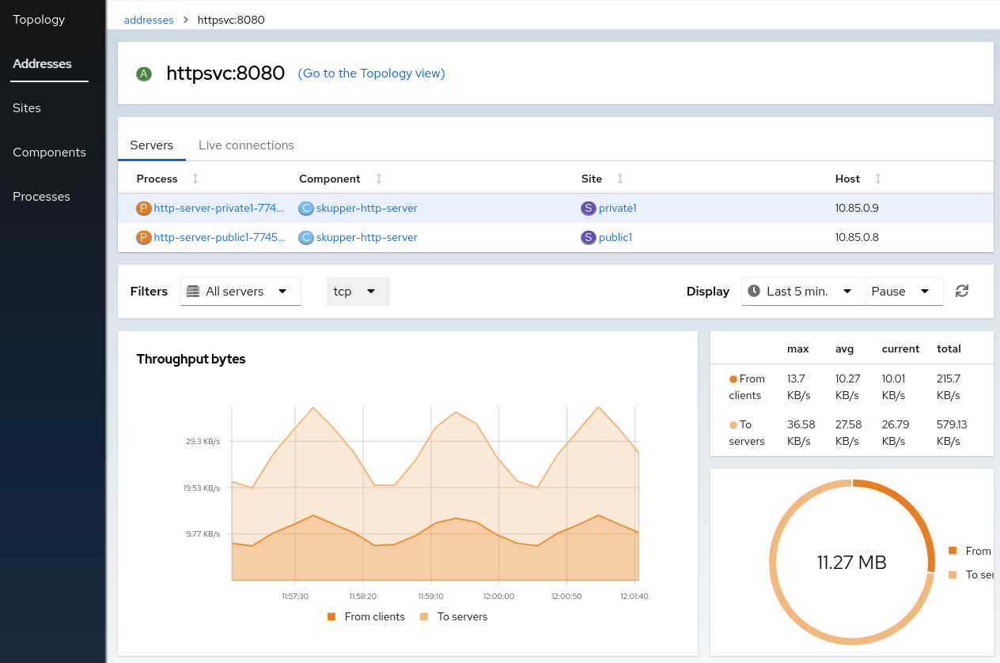

# Using the Skupper console

The Skupper console provides data and visualizations of the traffic flow between Skupper sites.

**📌 NOTE**\
This is a preview feature and may change before becoming fully supported by [skupper.io](https://skupper.io).

## Enabling the Skupper console

By default, when you create a Skupper site, a Skupper console is not available.

When enabled, the Skupper console URL is displayed whenever you check site status using `skupper status`.

* A Kubernetes namespace where you plan to create a site

1. Determine which site in your service network is best to enable the console.

   Enabling the console also requires that you enable the flow-collector component, which requires resources to process traffic data from all sites.
   You might locate the console using the following criteria:

   * Does the service network cross a firewall?
   For example, if you want the console to be available only inside the firewall, you need to locate the flow-collector and console on a site inside the firewall.
   * Is there a site that processes more traffic than other sites?
   For example, if you have a _frontend_ component that calls a set of services from other sites, it might make sense to locate the flow collector and console on that site to minimize data traffic.
   * Is there a site with more or cheaper resources that you want to use?
   For example, if you have two sites, A and B, and resources are more expensive on site A, you might want to locate the flow collector and console on site B.
2. Create a site with the flow collector and console enabled:

   ```bash
   $ skupper init --enable-console --enable-flow-collector
   ```

## Accessing the Skupper console

By default, the Skupper console is protected by credentials available in the `skupper-console-users` secret.

1. Determine the Skupper console URL using the `skupper` CLI, for example:

   ```bash
   $ skupper status

   Skupper is enabled for namespace "west" in interior mode. It is not connected to any other sites. It has no exposed services.
   The site console url is:  https://skupper-west.apps-crc.testing
   ```
2. Browse to the Skupper console URL.
The credential prompt depends on how the site was created using `skupper init`:

   * Using the `--console-auth unsecured` option, you are not prompted for credentials.
   * Using the `--console-auth openshift` option, you are prompted to enter OpenShift cluster credentials.
   * Using the default or `--console-user <user>  --console-password <password>` options, you are prompted to enter those credentials.
3. If you created the site using default settings, that is `skupper init`, a random password is generated for the `admin` user.
To retrieve the password the `admin` user:

   ```
   $ kubectl get secret skupper-console-users -o jsonpath={.data.admin} | base64 -d

   JNZWzMHtyg
   ```

## Exploring the Skupper console

After exposing a service on the service network, you create an _address_, that is, a service name and port number associated with a site.
There might be many replicas associated with an address.
These replicas are shown in the Skupper console as _processes_.
Not all participants on a service network are services.
For example, a _frontend_ deployment might call an exposed service named _backend_, but that frontend is not part of the service network.
In the console, both are shown so that you can view the traffic and these are called _components_.

The Skupper console provides an overview of the following:

* Topology
* Addresses
* Sites
* Components
* Processes

The Skupper console also provides useful networking information about the service network, for example, traffic levels.



1. Check the **Sites** tab.
All your sites should be listed.
See the **Topology** tab to view how the sites are linked.
2. Check that all the services you exposed are visible in the **Components** tab.
3. Click a component to show the component details and associated processes.
4. Click on a process to display the process traffic.

   **📌 NOTE**\
   The process detail displays the associated image, host, and addresses.
   You can also view the clients that are calling the process.
5. Click **Addresses** and choose an address to show the details for that address. This shows the set of servers that are exposed across the service network.

**💡 TIP**\
To view information about each window, click the **?** icon.
