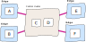
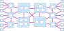

# Skupper connectivity

Skupper represents a new approach to connecting services across multiple Kubernetes clusters.
See how Skupper can give you the flexibility to deploy your services where you need them.

## One cluster

Kubernetes **services** provide a virtual network address for each element of your distributed application.
Service "A" can contact service "B", "B" can contact "C", and so on.

But if you want to deploy your application across multiple clusters, your options are limited.
You have to either expose your services to the public internet or set up a VPN.

Skupper offers a third way.
It connects clusters to a secure layer 7 network.
It uses that network to forward local service traffic to remote clusters.

## Secure hybrid cloud communication

Deploy your application across public and private clusters.

You can host your database on a private cluster and retain full connectivity with services running on the public cloud.
All communication is secured by mutual TLS authentication and encryption.

## Edge-to-edge connectivity

Distribute application services across geographic regions.

You can connect multiple retail sites to a central office.
Once connected, each edge location can contact any other edge.
You can add and remove sites on demand.

## Scale up and out

Build large, robust networks of connected clusters.

* [Overview](index.adoc)
* [Routing](routing.adoc)
* [Connectivity](connectivity.adoc)
